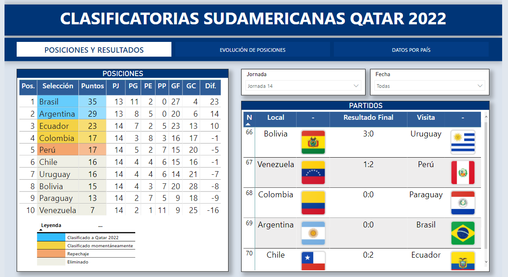

# Dashboard - Clasificatorias Sudamericanas Qatar 2022

  El presente <a href="https://app.powerbi.com/view?r=eyJrIjoiY2RjNTQ3ZjQtNWE0YS00ODFhLWFjYzAtNWMzMjdlZWI3ZTVjIiwidCI6ImU4ZGM2OTlhLWYyYmMtNDMwYy04NTc1LTBhOTUyODEzZDExMSIsImMiOjl9">dashboard</a> muestra las posiciones de las selecciones de Sudamérica en su clasificación al mundial de Qatar 2022. Además muestra los resultados de los encuentros ya disputados y los próximos por jornada, la evolución de la posición de cada selección, y datos diversos de cada una.

<blockquote>
  
</blockquote>

  La información utilizada para su creación se extrajo de las siguientes páginas web: Artículo sobre la <a href="https://es.wikipedia.org/wiki/Clasificaci%C3%B3n_de_Conmebol_para_la_Copa_Mundial_de_F%C3%BAtbol_de_2022">Clasificación de Conmebol para la Copa Mundial de Fútbol de 2022</a>, 
  <a href="https://www.fichajes.com/sudamerica/eliminatorias-mundial-sudamerica/estadistica-jugadores/asistencias">Estadística de jugadores - Eliminatoria mundial Sudamérica</a>
  y 
  <a href="https://www.futbolargentino.com/eliminatorias/goleadores">Goleadores de la eliminatoria sudamericana</a>.

   Los datos extraídos pasaron por procesos ETL (Extract, Transform and Load) desde Power Query, luego fueron modelados creando una estructura que permita relacionar las distintas tablas, además se creó fórmulas DAX que permiten un mejor entendimiento de la información mostrada en las visualizaciones que componen este trabajo. Finalmente, el dashboard fue publicado en Power BI Service para poder compartirlo y visualizarlo en línea.

  

  Los invito a darle click al siguiente 
  <a href="https://app.powerbi.com/view?r=eyJrIjoiY2RjNTQ3ZjQtNWE0YS00ODFhLWFjYzAtNWMzMjdlZWI3ZTVjIiwidCI6ImU4ZGM2OTlhLWYyYmMtNDMwYy04NTc1LTBhOTUyODEzZDExMSIsImMiOjl9">link</a>
   para que interactúen.

